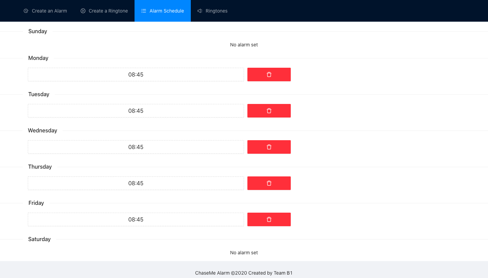

## Overview

The full stack MERN(MongoDB, Express.js, React.js, Node.js) web application provides an interface for users to set alarms and customize ringtones for iRobot. A Raspberry Pi is needed on the iRobot client to complete the setup. 

## Frontend

On the application interface(as seen in Figure 3), users can create alarms, view current alarms, create ringtones, and view current ringtones on different tabs. Across all tabs, users are given the option to play ringtones - on the first two tabs, users can play a ringtone set together with a certain alarm; on the last two tabs, users can play the ringtone on its own; on “Create a Ringtone” tab, users can preview the ringtone currently being created, or play individual notes from the ringtone. When the pitch and duration defined for a note changes, the sound of the notes also changes accordingly, as expected.
The frontend is built with React.js framework; the visual components are from Ant Design React.js library. The npm module soundfont-player is used for audio effects.

“Create an Alarm” tab

“Current Alarms” tab

“Create an Ringtone” tab

“Current Ringtones” tab

Sign in page


## Backend

An Express server is built to handle API requests from the frontend. Below is a list of REST API endpoints that the backend server handles:

- GET /alarms - Retrieve alarms of an user
- GET /ringtones - Retrieve all public ringtones or private ringtones of an user
- POST /alarms - Create a new alarm for an user
- POST /ringtones - Create a new ringtone for an user
- DELETE /alarms - Delete an alarm for an user
- DELETE /ringtones - Delete a ringtone for an user

Each of the endpoints either writes to or updates MongoDB database when a request to the endpoint is received. As you can see there are only two types of data involved, alarms and ringtones. Although there is no fixed schema for either, a typical alarm entry looks like this in the database:
```
{
  "ringtone": 
  {
    "notes":
      [ 76, 16, 76, 16, 76, 32, // pitch1, duration1, pitch2, duration2, pitch3, duration3, ...
        76, 16, 76, 16,
        76, 32, 76, 16,
        79, 16, 72, 16,
        74, 16, 76, 32 ],
    "name": "Jingle Bell"
  }
}
```
On the other hand, a typical ringtone entry is defined like so in the database:
```
{
  "day": "Sunday",
  "time": "2020-12-05T11:21:53.775Z",
  "user": "albWgXTszpCMBUvxVNetYKkx8h03",
  "ringtone": 
  {
    "notes": …. ,
    "name": "Jingle Bell"
  }
}
```
## Alarm Scheduling

One endpoint in particular, POST /alarms, for creating alarms, also writes to a message queue(built with AWS SQS). The message contains the ringtone data, and is sent to the queue at the alarm time defined. Then immediately after, Pi hosted on top of iRobot reads from the queue and initiates the robot sequence, effectively starting the alarm.
However, remember the alarm also recurs every week. Hence, the npm module node-cron is used here to schedule a cron job, for each alarm, that sends a message like above to the message queue every week. It is important that the message is scheduled to send right on alarm time, because Pi is constantly listening to the message queue update and will interpret each new message as a call to start iRobot’s action.
Testing for Alarm Scheduling: To verify that the jobs did get scheduled and get executed at the scheduled times, we implemented a log to keep track of all actions related to message queue changes. In the end, we have ~300 lines of entry on our log files(on both development and production servers) which we have then manually verified to confirm that there is no inconsistency in the job scheduling behaviour. The manual verification procedure includes:
- for each alarm creation, verify if there is a line of log for the cron job being scheduled(one more job in the cron job pool), and that the job is scheduled at alarm time
- for each effective alarm, verify if there is a line of log for the cron job being executed, and that the job is executed at the alarm time, consistently every week, with the right ringtone data
- for each alarm cancellation, verify if there is a line of log for the cron job being cancelled(one fewer job in the cron job pool), and the same cron job does not get executed again after cancellation

## Timezone Management

One of the difficulties working on this application is that the server and the client browser(user) are in different time zones. Different users live in varying time zones and even the same user might use the web application from a few time zones. Hence, it is essential to coordinate these time zone differences by first adopting the javascript Moment class as the only format. Moreover, the frontend interprets the time of the alarm created by the user in the user's browser timezone; the backend then interprets the time of the alarm in the server’s time zone, through a middleware setting, before scheduling the cron job on its machine. This way, we ensure the accuracy of the timezone conversion and the consistency of the alarm times across server and client. Users are also able to enjoy a more intuitive experience when setting alarms, since they do not have to guess the timezone the server is in in order to set the alarms.

## User Management

To ensure users can only view their own alarms, there needs to be a mechanism to separate data created by different user entities. We use Firebase Authentication as a way to keep a record of all users. First time users need to log in using their Google accounts to make sure there is a valid user ID logged in the Firebase backend. We also define the endpoints as such that users can call the APIs with their own user IDs, to view their private alarms/ringtones. One exception is the public repository of ringtones, which everybody can access. 

## Deployment:

The website is hosted on a AWS EC2  instance (Ubuntu machine). Both backend and frontend are deployed using the process manager for Javascript runtime Node.js, pm2. The website is hosted [here](http://ec2-3-129-61-132.us-east-2.compute.amazonaws.com:4000/) but might not be available after the instance is terminated at the end of the Fall 2020 semester.

## Future improvements

- [ ] update POST API endpoints
- [ ] store alarm cron job IDs to MongoDB
- [ ] test when multiple users set alarms at the same time, if latency of queue consumer will be affected

## To host the web app locally

1) In root directory, do `npm i`
2) In `frontend/`, do `npm i`
3) In `backend/`, do `npm i`
4) In root directory, do `npm run dev`

You will need (1) AWS credentials, (2) Google credentials, (3) an SQS queue, (4) a MongoDB Atlas cluster in order for it to work. 
Here is a [sample client snippet](https://github.com/18500-F20-B1/RPi/tree/yh-sqs).

## To host the web app on an EC2 instance

1) In `frontend/`, do `npm run build`
2) In root directory, do `npx pm2 start frontend/run.sh --name frontend`
3) In root directory, do `npx pm2 start backend/index.js --name backend`

You will need (1) AWS credentials, (2) Google credentials, (3) an SQS queue, (4) a MongoDB Atlas cluster in order for it to work. 
Here is a [sample client snippet](https://github.com/18500-F20-B1/RPi/tree/yh-sqs).

## Misc

### A little tip for working with pm2 on EC2

`sudo pm2 start app.js` command will not work on an EC2 instance when one logs in as an instance user(`ssh .... ec2-user@IPv4`) due to the lack of root access. Instead, call `npx` to execute `serve` or `pm2` commands instead.
